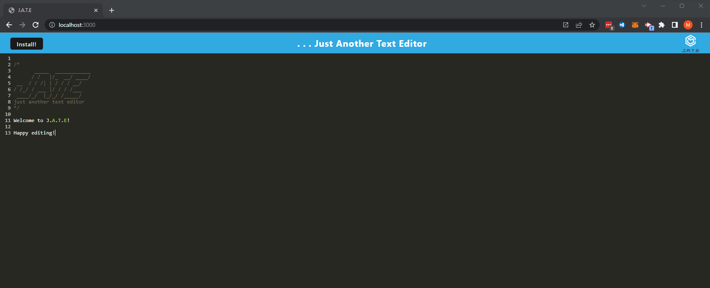
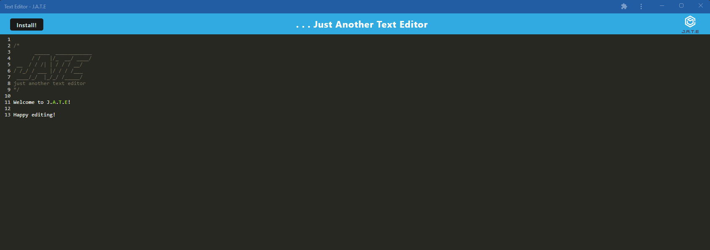

# J.A.T.E - Just Another Text Editor

# Description

As a developer using a PWA (progressive web application), this application allows for the creation of notes or code snippets on a single page application with or without an internet connection. The application can then be viewed and edited at a later time.

Some of the technologies used in this application include: 
- express
- webpack
- service-worker
- nodemon
- babel
- concurrently

# Table of Contents

* [Installation](#Installation)
* [Usage](#Usage)
* [License](#License)
* [Deployed](#Deployed)
* [Screenshots](#Screenshots)
* [Credits](#Credits)
* [Questions](#Questions)

# Installation 

Installation of the required npm packages will be invoked using the following command: 

`npm install`

# Usage

To run the application with nodemon for dev usage, invoke the following command: 

`npm run dev`

To start the build and the server , invoke the following command: 

`npm start`

# License

Apache 2.0

#### For more information on the license, click the badge icon in the title section.

# Deployed

To see the deployed Heroku application click [here]()

# Screenshots

# Credits

University of Sydney Coding Bootcamp

# Questions

### For further information contact using the following:

#### GitHub: [mdkgray](https://github.com/mdkgray)

#### Email: mdkulen@gmail.com

_This README was generated using [README Generator](https://github.com/mdkgray/README_generator)_
